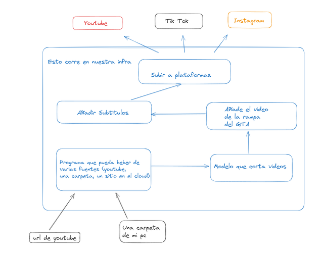

# Short-Fast

Programa para automatizar el procesamiento y la subida de videos cortos a plataformas.

> [!NOTE]
> Manten el requirements.txt actualizado

## TO DO
- Reciver
    - Actualizar el front para mandar url de YT y que descargue el video
    - Ponerlo un poco bonito.
    - Hacer que mande el video al cortador
- Modelo para cortar los videos
- Editar video para poner "la rampa"
- Subitulos
    - Montarlo para que procese videos recividos de un socket
    - Hacer mas grandes y coloridos los subtitulos
- Mandar video a las APIs
- Dockerfiles
    - Python
- docker-compose

>[!WARNING]
> TENED EN CUENTA QUE TENDREMOS QUE USAR VARIABLES DE ENTORNO PARA CONTRASEÑAS Y CUANDO PONGAMOS LOS PUERTOS Y HOSTS BUENOS

## Quien hace que
- @ElPasSan --> edicion
- @Pignacus --> subtitulos
- @enriqueav99 --> cortar los videos en partes interesantes y lo que
tenga que ver con docker

